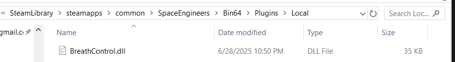
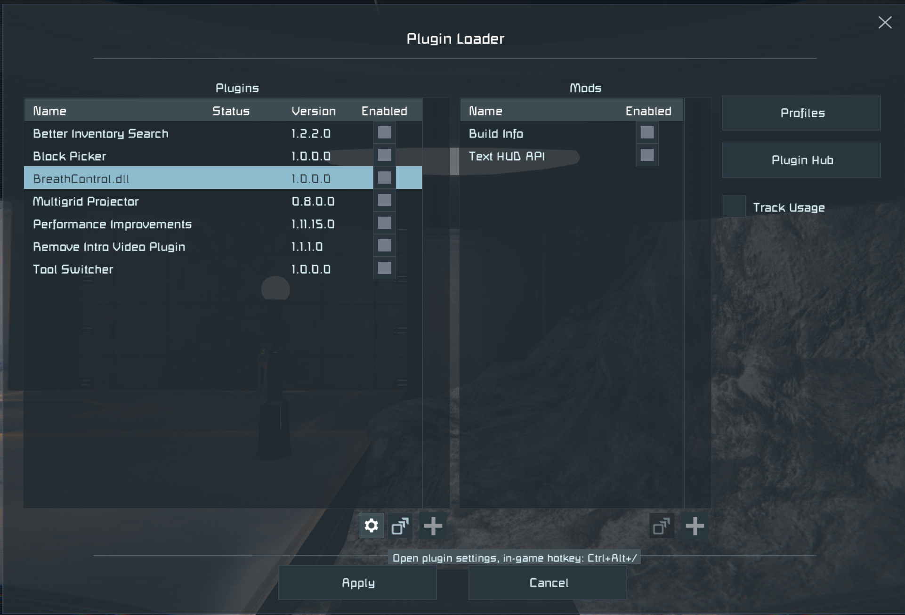
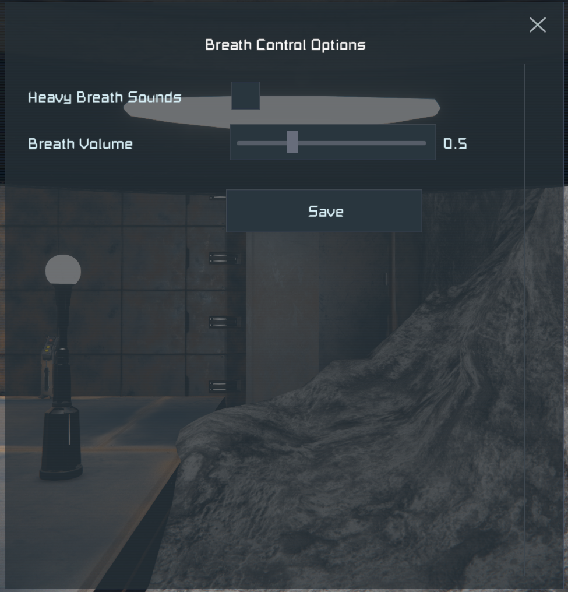

# Breath Control for Space Engineers

See base template and requirements to build here:  
[Server/Client version of the template](https://github.com/sepluginloader/PluginTemplate)

## Description

The heavy breathing noise when using realistic sound in Space Engineers is very loud. It also plays VERY often. For a long duration.  
I hate it. I am sure you do too, so I slapped this together to make it stop.  

## Installation

At some point this should be on plugin hub. Until then, you can install this plugin by dragging the associated DLL to:  
YourSteamLibraryLocation\common\SpaceEngineers\Bin64\Plugins\Local  (See Below)



You may need to ensure that <LocalFolderPlugins /> is set in plugin loader's config.xml:  
SpaceEngineers\Bin64\Plugins\config.xml  
```
<PluginConfig xmlns:xsd="http://www.w3.org/2001/XMLSchema" xmlns:xsi="http://www.w3.org/2001/XMLSchema-instance">
  <Plugins>
   ...
  </Plugins>
  <LocalFolderPlugins /> <- this must be present
  <Profiles />
  <PluginSettings>
```

### Info

This plugin can be adjusted in-game through the plugin menu when you press escape.  



